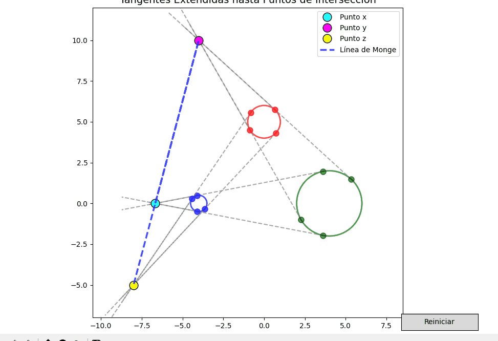

# Proyecto de Primer Bimestre Metodos Numéricos Gr1CC
## Integrantes Grupo 6
- Celeste Gallardo
- Daniel Menendez
- Jesua Villacís

##  Características Principales
- **Interfaz interactiva**: Arrastra círculos con el mouse para ver cambios en tiempo real.
- **Cálculo preciso**: 
  - Tangentes externas entre pares de círculos.
  - Puntos de intersección (x, y, z) y línea de Monge.
- **Visualización clara**:
  - Círculos: Azul, verde, rojo.
  - Puntos de intersección: Cyan (x), Magenta (y), Amarillo (z).
  - Línea de Monge en color azul.

## GIF de presentación
